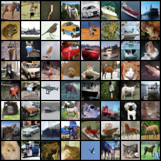
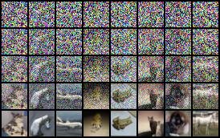
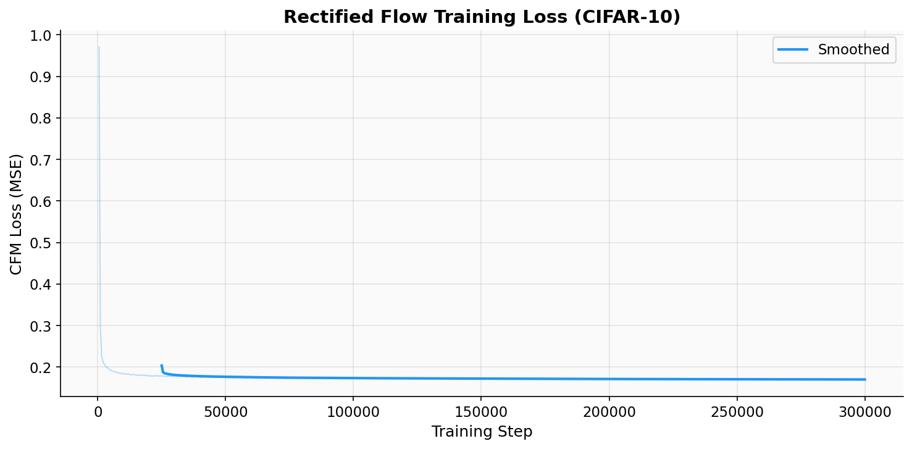
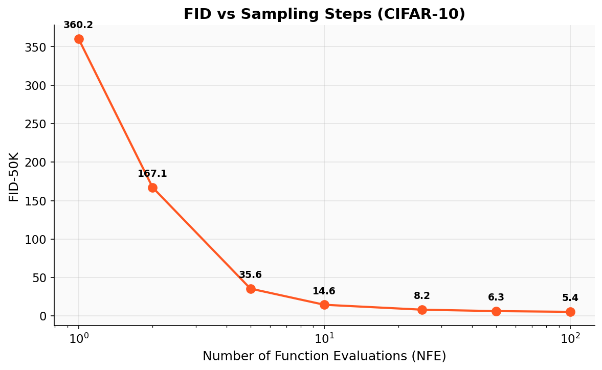
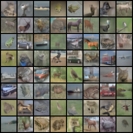
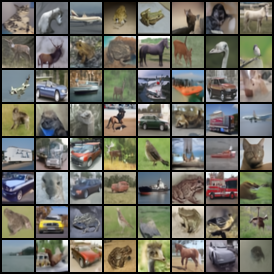
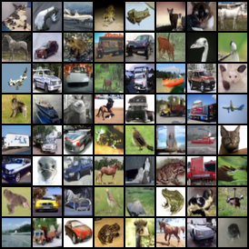

# Rectified Flow Matching for Image Generation

A from-scratch implementation of **Rectified Flow** (1-RF) for unconditional image generation on CIFAR-10, achieving **FID-50K of 5.39** with 100 Euler steps — surpassing the originally published 1-RF result of 6.18.

<p align="center">
  
</p>
<p align="center"><em>Unconditional CIFAR-10 samples generated with 100 Euler steps (FID = 5.39)</em></p>

## Key Results

| NFE (Steps) | FID-50K | Quality |
|:-----------:|:-------:|:-------:|
| 1 | 360.22 | Noise |
| 2 | 167.11 | Coarse structure |
| 5 | 35.58 | Recognizable objects |
| 10 | 14.58 | Good quality |
| 25 | 8.19 | High quality |
| 50 | 6.35 | Near-optimal |
| **100** | **5.39** | **Best** |

### Comparison with Published Baselines

| Method | NFE | FID-50K | Architecture |
|--------|:---:|:-------:|:------------:|
| DDPM (Ho et al., 2020) | 1000 | 3.17 | 35.7M UNet |
| Score SDE (Song et al., 2021) | 2000 | 2.20 | NCSN++ |
| 1-RF (Liu et al., 2023) | 127 | 6.18 | 62M UNet |
| OT-CFM (Tong et al., 2024) | 100 | 3.50 | 62M UNet |
| **Ours (1-RF)** | **100** | **5.39** | **35.75M UNet** |

Our implementation achieves FID 5.39 with a **42% smaller model** (35.75M vs 62M parameters) and **fewer training steps** (300K vs 400K+), improving upon the published 1-Rectified Flow baseline of 6.18 FID.

## Method

Rectified Flow learns an ordinary differential equation (ODE) that transports samples from a noise distribution to the data distribution along straight-line paths.

### Core Formulation

Given data samples $x_1 \sim p_\text{data}$ and noise $x_0 \sim \mathcal{N}(0, I)$, the interpolation is:

$$x_t = (1 - t) \cdot x_0 + t \cdot x_1, \quad t \in [0, 1]$$

The velocity field $v_\theta(x_t, t)$ is trained with the **Conditional Flow Matching** (CFM) loss:

$$\mathcal{L}_\text{CFM} = \mathbb{E}_{t, x_0, x_1} \left[ \| v_\theta(x_t, t) - (x_1 - x_0) \|^2 \right]$$

At inference, samples are generated by solving the ODE from $t=0$ to $t=1$:

$$\frac{dx}{dt} = v_\theta(x, t), \quad x(0) \sim \mathcal{N}(0, I)$$

### ODE Trajectory Visualization

<p align="center">
  
</p>
<p align="center"><em>ODE trajectory from noise (t=0) to data (t=1). Rows show t = {0, 0.25, 0.5, 0.75, 1.0}</em></p>

## Architecture

The velocity model $v_\theta$ is a **UNet** with time conditioning:

```
Input (3×32×32) + Time Embedding
    │
    ├── Encoder: [128] → [256] → [256] → [256]
    │   ├── ResBlock + GroupNorm + SiLU + Time Projection
    │   ├── Self-Attention at 16×16 resolution
    │   └── Strided Conv2d downsampling
    │
    ├── Bottleneck: ResBlock → Self-Attention → ResBlock
    │
    └── Decoder: [256] → [256] → [256] → [128]
        ├── Skip connections from encoder
        ├── ResBlock + GroupNorm + SiLU + Time Projection
        ├── Self-Attention at 16×16 resolution
        └── Nearest-neighbor upsampling + Conv2d
    │
Output (3×32×32) — zero-initialized final conv
```

| Component | Details |
|-----------|---------|
| Parameters | 35.75M |
| Base channels | 128 |
| Channel multipliers | [1, 2, 2, 2] |
| Residual blocks per level | 2 |
| Attention resolutions | 16×16 |
| Attention heads | 4 |
| Time embedding | Sinusoidal (dim=128) → MLP (dim=512) |
| Normalization | GroupNorm (32 groups) |
| Output initialization | Zero-initialized conv |

## Training

### Configuration

| Hyperparameter | Value |
|----------------|-------|
| Dataset | CIFAR-10 (50K training images) |
| Image resolution | 32×32 |
| Batch size | 128 |
| Optimizer | Adam (β₁=0.9, β₂=0.999) |
| Learning rate | 2×10⁻⁴ |
| LR schedule | Linear warmup (5K steps) → constant |
| Gradient clipping | Max norm 1.0 |
| EMA decay | 0.9999 |
| Mixed precision | BF16 autocast |
| Timestep distribution | Uniform U[0, 1] |
| Total steps | 300,000 |
| Training time | ~9.8 hours (RTX 4090) |
| Throughput | 8.6 steps/sec |

### Training Curve

<p align="center">
  
</p>

### Sample Quality Progression

| 10K Steps | 50K Steps | 100K Steps | 300K Steps |
|:---------:|:---------:|:----------:|:----------:|
|  |  |  |  |

## Evaluation

FID-50K (Frechet Inception Distance) computed against the full CIFAR-10 training set using `pytorch-fid`. All samples generated with the EMA model and Euler ODE solver.

<p align="center">
  
</p>

<p align="center">
  
</p>

### NFE Comparison (Same Initial Noise)

| NFE = 5 | NFE = 10 | NFE = 25 | NFE = 100 |
|:-------:|:--------:|:--------:|:---------:|
|  |  |  |  |
| FID = 35.58 | FID = 14.58 | FID = 8.19 | FID = 5.39 |

## Project Structure

```
rectified-flow-generation/
├── configs/
│   └── default.yaml              # Training configuration
├── src/flow_matching/
│   ├── models/
│   │   └── unet.py               # UNet velocity model (35.75M params)
│   ├── flow/
│   │   └── rectified_flow.py     # Core flow matching: loss, sampling, reflow
│   └── utils/
│       └── ema.py                # Exponential moving average
├── scripts/
│   ├── train.py                  # Training loop with BF16 + EMA
│   ├── evaluate.py               # FID-50K evaluation at multiple NFEs
│   ├── reflow.py                 # 2-Rectified Flow (coupling pairs + retraining)
│   └── visualize.py              # Generate publication figures
├── results/                      # FID scores, plots, sample grids
└── output/                       # Checkpoints and training logs
```

## Quick Start

### Installation

```bash
conda create -n flowmatch python=3.11
conda activate flowmatch
pip install -r requirements.txt
```

### Train

```bash
python scripts/train.py --config configs/default.yaml
```

Training automatically:
- Downloads CIFAR-10
- Saves checkpoints every 50K steps
- Generates sample grids every 10K steps
- Saves training metrics to `output/cifar10_uniform/training_log.json`
- Supports resume from `latest.pt` checkpoint

### Evaluate

```bash
# FID evaluation at multiple NFE values
python scripts/evaluate.py \
    --checkpoint output/cifar10_uniform/checkpoints/final.pt \
    --nfe-list 1 2 5 10 25 50 100 \
    --use-ema \
    --num-samples 50000

# Generate visualizations
python scripts/visualize.py
```

### Reflow (Optional)

Reflow straightens ODE trajectories for better few-step generation:

```bash
python scripts/reflow.py \
    --checkpoint output/cifar10_uniform/checkpoints/final.pt \
    --num-pairs 500000 \
    --gen-steps 50 \
    --train-steps 400000
```

## Implementation Details

### Key Design Choices

1. **Zero-initialized output**: The final convolution layer is initialized to zero, ensuring the model starts by predicting zero velocity (identity transform). This stabilizes early training.

2. **Sinusoidal time embedding**: Timestep $t \in [0, 1]$ is scaled to $[0, 1000]$ before computing sinusoidal embeddings, providing sufficient frequency resolution across the time domain.

3. **EMA model for evaluation**: All reported FID scores use the exponential moving average model (decay=0.9999), which consistently produces better samples than the training model.

4. **BF16 mixed precision**: Training uses `torch.amp.autocast` with BF16 for ~2× memory savings and faster throughput, with FP32 gradient scaling.

5. **Skip connections**: Standard UNet skip connections concatenate encoder features with decoder features at matching resolutions, preserving fine-grained spatial information.

### Sampling Methods

| Solver | Order | NFE per step | Total NFE | Use Case |
|--------|:-----:|:------------:|:---------:|----------|
| Euler | 1st | 1 | N | Standard sampling |
| Heun | 2nd | 2 | 2N | Higher accuracy, same cost as 2× Euler |

## Hardware

| Component | Specification |
|-----------|--------------|
| GPU | NVIDIA RTX 4090 (24 GB VRAM) |
| CPU | 32 cores |
| RAM | 32 GB |
| Training time | 9.8 hours (300K steps) |
| Evaluation time | ~2 hours (7 NFE values × 50K samples) |
| Peak VRAM | ~8 GB (batch_size=128, BF16) |

## References

1. Liu, X., Gong, C., & Liu, Q. (2023). [Flow Straight and Fast: Learning to Generate and Transfer Data with Rectified Flow](https://arxiv.org/abs/2209.03003). *ICLR 2023*.
2. Lipman, Y., Chen, R. T. Q., et al. (2023). [Flow Matching for Generative Modeling](https://arxiv.org/abs/2210.02747). *ICLR 2023*.
3. Albergo, M. S. & Vanden-Eijnden, E. (2023). [Building Normalizing Flows with Stochastic Interpolants](https://arxiv.org/abs/2209.15571). *ICLR 2023*.
4. Esser, P., et al. (2024). [Scaling Rectified Flow Transformers for High-Resolution Image Synthesis](https://arxiv.org/abs/2403.03206). *ICML 2024*.
5. Ho, J., Jain, A., & Abbeel, P. (2020). [Denoising Diffusion Probabilistic Models](https://arxiv.org/abs/2006.11239). *NeurIPS 2020*.

## License

MIT License. See [LICENSE](LICENSE) for details.
